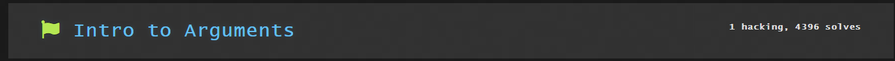

This module was about understanding basics of command line and to learn how to execute commands.

It first taught how to run commands by using a command `whoami` which printed the username to the terminal. 
The challenge was to run the `hello` coomand which would give the flag.

It taught how to use command with arguments, which are the additional data passed to command. 
In this challenge `echo` was the command and 'Hello' was the argument 
The command `echo Hello` printed 'Hello' to the terminal.

The challenge was to print run the `hello` command with a single argument of 'hackers' 
Running `hello hackers` gave the flag