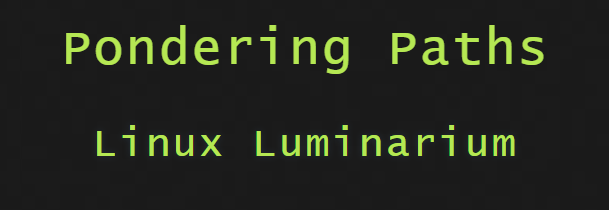
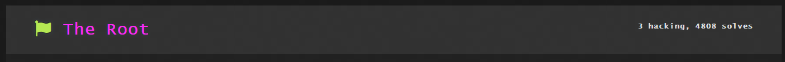
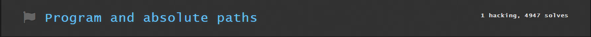
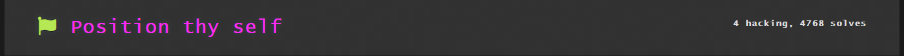
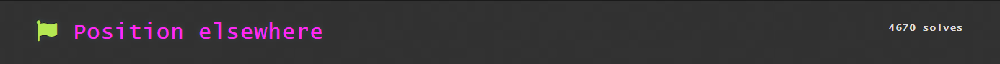
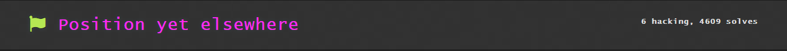

This module is about learning the basics of Linux file paths. 

1st challenge is about learning how to access a program named `pwn` using the `/pwn` command. `/` is the symbol for the root directory, the words following it are the names of the programs/paths that follow.
`/pwn` is the path to the pwn program under the root directory.
Flag was obtained by entering `/pwn` command on the terminal 
Flag: pwn.college{geL3ISy0aupqQVj-MuwqI7vtjWO.dhzN5QDL0IzN0czW}

This challenge was teaching a bit more complex way of accessing the `run`  directory which was inside a `challenge` directory in te `/` directory.
Flag was obtained by running the absolute path command `/challenge/run`
Flag: pwn.college{EMqlcj7mnQax2BGlU3c4go0W1LU.dVDN1QDL0IzN0czW}

This challenge wanted me to invoke the absolute path from the right directory.

I tried invoking `/challenge/run` command to which it showed

Incorrect..
And told me I was not in the correct directory

I ran the `cd /usr/share/zoneinfo/posix/Asia` command to get to the right directory and then ran the `/challenge/run` command to get my flag.
Flag: pwn.college{ILrXGKs9iIHxy_1flcso0xl9xJI.dZDN1QDL0IzN0czW}

This was a similar challenge to what we did in the last challenge
 I tried invoking `/challenge/run` to which it chowed
 Incorrect.. 
 And told me I was not in the correct directory

 I ran the `cd /proc/192/fd` command to enter the correct directory and then the `/challenge/run` to get the flag.

Flag: pwn.college{8X1q0f-EkinMZ7VkBxL1BG_qpYp.ddDN1QDL0IzN0czW}

 This was the same challenge to what we did in the last ones
 I tried invoking `/challenge/run` to which it chowed
 Incorrect.. 
 And told me I was not in the correct directory

 I ran the `cd /usr/share/zoneinfo/posix/Asia` command to enter the correct directory and then the `/challenge/run` to get the flag.

Flag: pwn.college{ka5l_Cx1zFLrfUEYIa4qdeXVTeJ.dhDN1QDL0IzN0czW}

